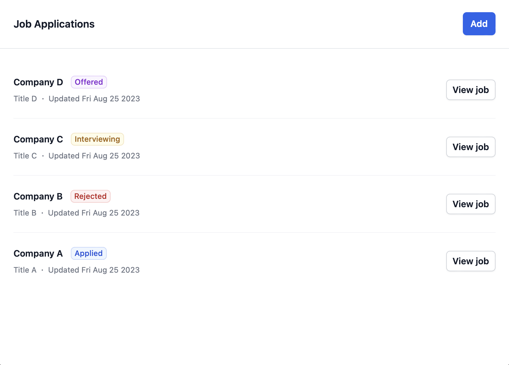
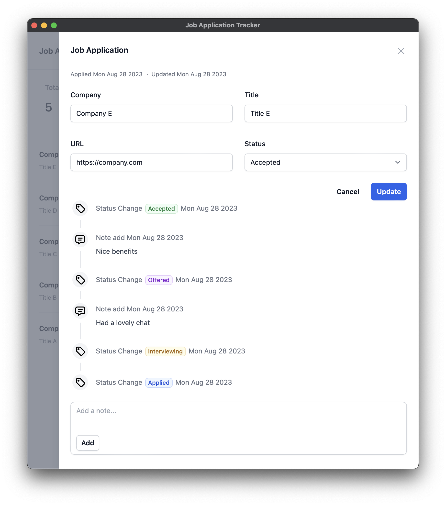

# Job Application Tracker

Job hunting can be difficult. There are many things to track. Such as,

- Where have you applied?
- What was the position?
- When did you apply?
- What is the description of the position?
- What is the status of the application?
- Do you have any notes about the application?

This desktop application is designed to help you track your job applications.

The application also tracks the history of a Job Application.

## Installation

Got to the [releases](https://github.com/Piszmog/job-app-tracker/releases) and download the latest release for your
operating system.

## TODOS

- Finish README
- Pretty statistics
- Delete Job Application
